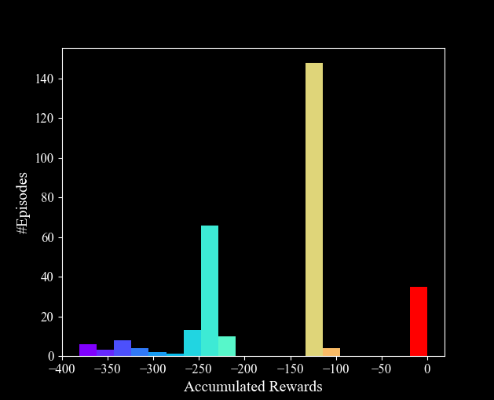
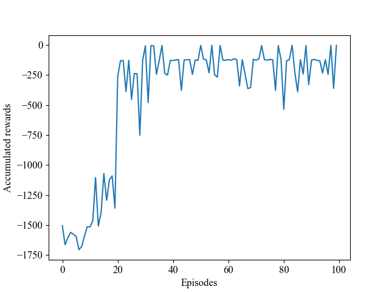
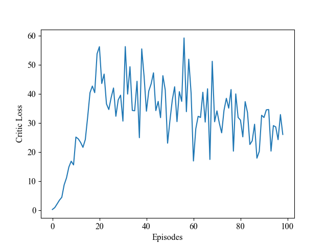
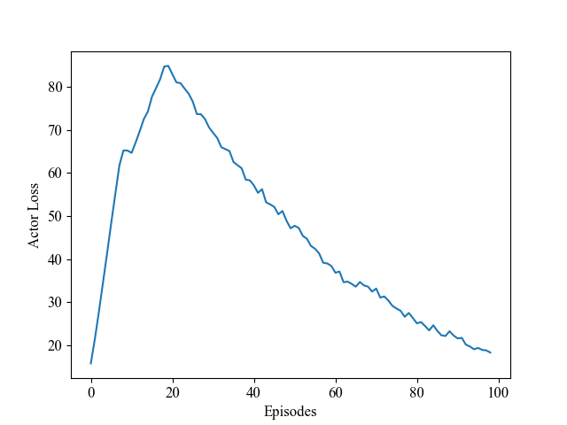

# DDPG
Depp_Deterministic_Policy_Gradient
tested on **Pendulum-v0**
Original paper: 
[Link](https://arxiv.org/abs/1509.02971).

# Results 
Based 300 games

# Training plots
<!---
your comment goes here 
and here 

-->

### Critic Loss plot

### Actor Loss 

